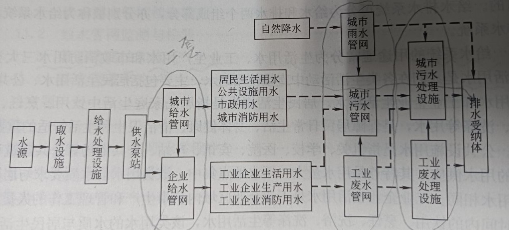
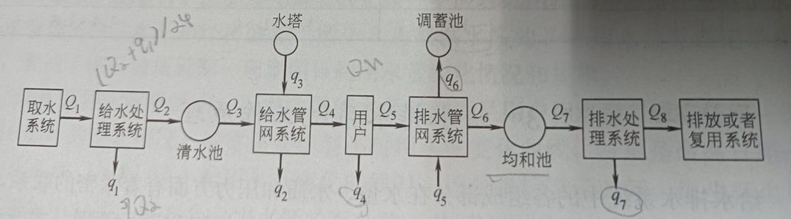

  

---------------------------------------------------------------------------

# 管网水力模型

*Pipe Network Model*  

给水排水系统是人类文明进步和城市化聚集居住的产物，  
是为人们的生活、生产和消防提供用水和排除废水的设施总称，是城市社会和经济发展现代化水平的重要标志。

原水从水源地进入系统后，一个典型的 **给水排水系统流程** 包括  
依次经过取水系统、给水处理系统、给水管网系统、用户、排水管网系统、排水处理系统，最后排放或复用。

给水排水系统的功能时向各种不同类别的用户供应满足需求的水质和水量，同时承担用户排除的废水的收集、  
输送和处理，消除废水中污染物质对人体健康的危害和保护环境。  
给水排水系统，按照系统功能可以包含以下划分出的功能子系统：   
1. 原水取水系统；
2. 给水处理系统；
3. 给水管网系统；
4. 排水管网系统；
5. 废水处理系统；
6. 排放和重复利用系统。

---------------------------------------------------------------------------