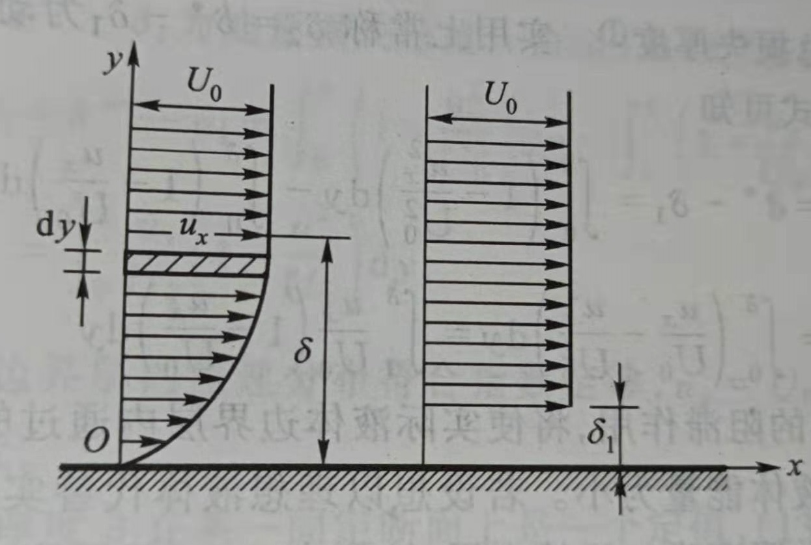
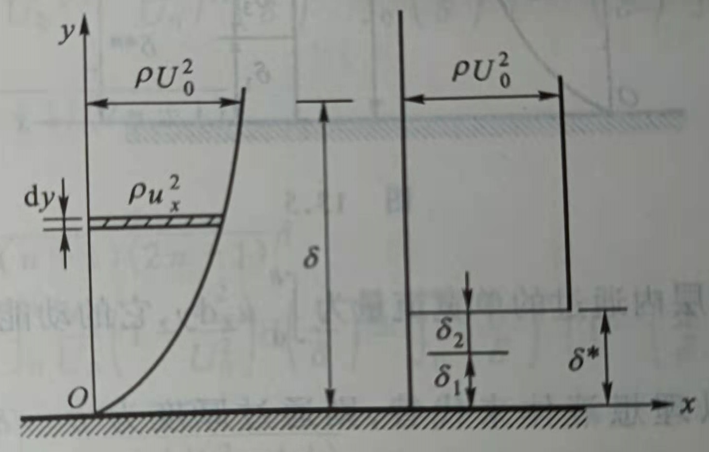
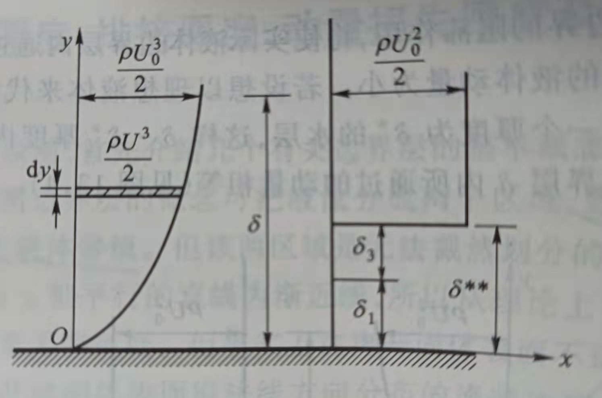
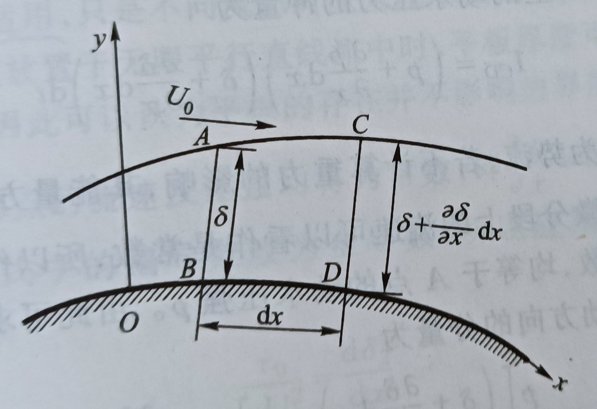
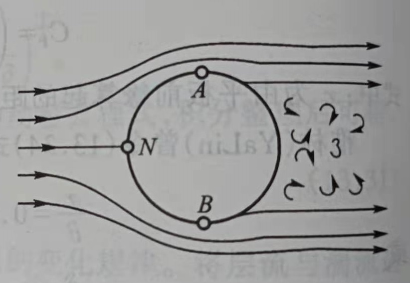
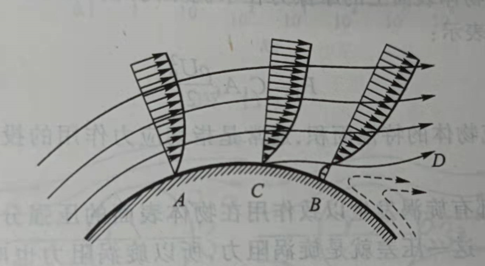
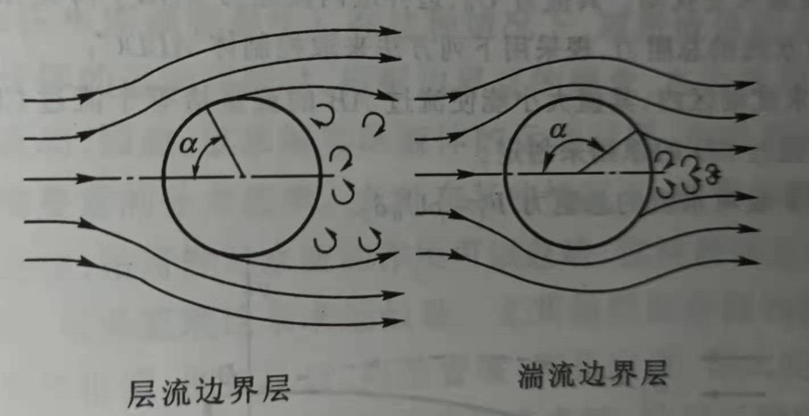
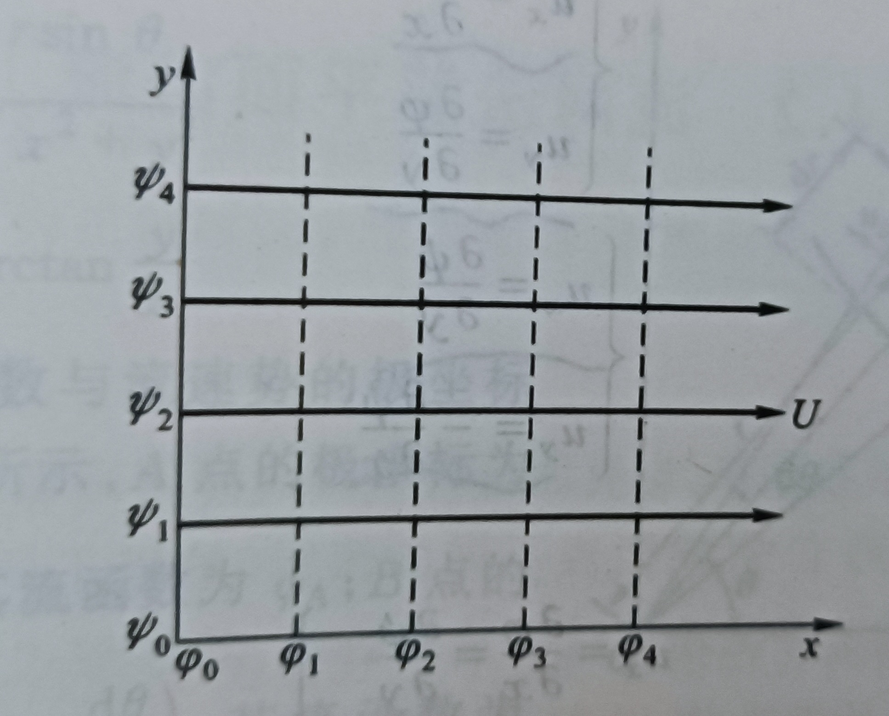
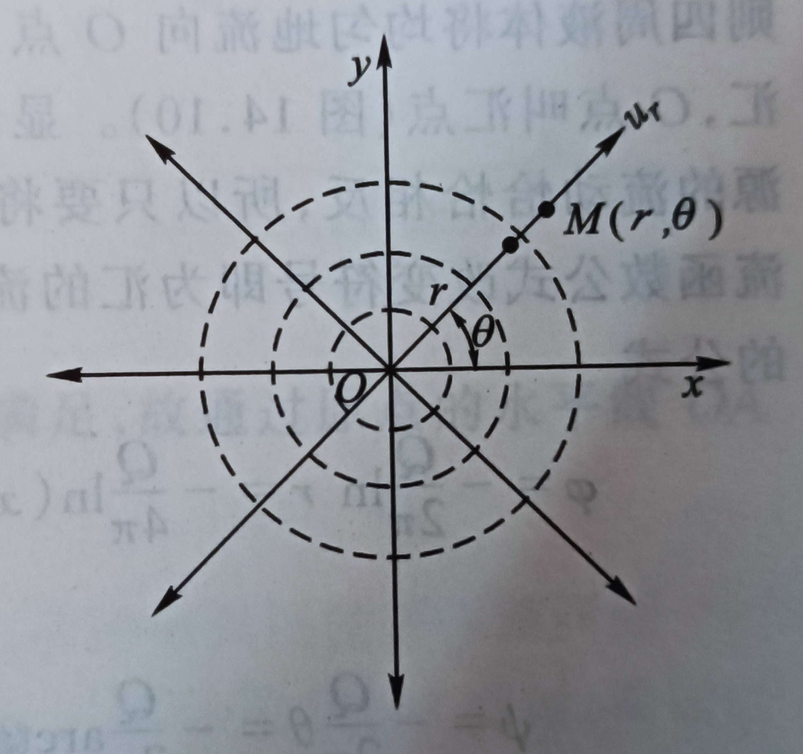
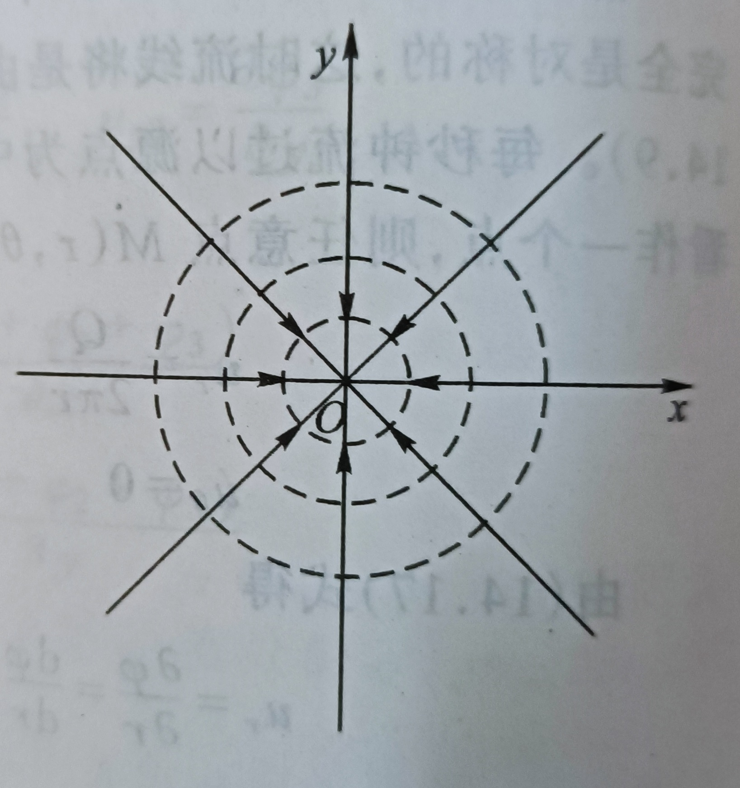

  

---------------------------------------------------------------------------------

# 纳维-斯托克斯方程组

*Navier Stokes Equations 2*  

本篇主要是继续介绍在纳维-斯托克斯模型框架下的流体力学现象和理论。

+ [边界层](#边界层)
+ [恒定平面势流](#恒定平面势流)
+ [量纲分析](#量纲分析)
+ [相似原理](#相似原理)

---------------------------------------------------------------------------------

## 边界层

*Boundary Layer*

$$\begin{cases}
u_x\frac{\partial u_x}{\partial x} + u_y\frac{\partial u_x}{\partial y} = - \frac{1}{\rho}\frac{\partial p}{\partial x} + \nu \frac{\partial^2 u_x}{\partial y^2}  \\
  \\
\frac{\partial p}{\partial x} = 0 \\
  \\
\frac{\partial u_x}{\partial x} + \frac{\partial u_y}{\partial y} = 0 \\
\end{cases}$$
 
分析边界层的微分方程组，可以知道：  
+ 边界层内压强沿 y 方向不变并等于边界层外边界上的压强；边界层外边界上压强可由势流理论求解，内部压强可知；
+ 惯性项和粘性项既均不能省略，则应有相同的数量级，$\frac{U_{0}^{2}}{l} \sim \nu \frac{U_0}{\delta^2} \quad \Rightarrow \frac{\delta}{l} \sim \frac{1}{\sqrt{R_{el}}}, \quad R_{el} = \frac{U_0 l}{\nu}$;
+ 边界层的厚度 $\delta$ 与绕流物体长度 $l$ 的比值的数量级，是以该物体长度表示的雷诺数平方根的倒数 ；
+ 方程虽基于平面绕流推导，但一般可用于曲率较小的曲面边界层：此时，取固体表面曲线为 x 轴，曲线法向为 y 轴。

依据边界层的概念，可将流体分为两个区域：边界层内的粘滞流动和边界层外的理想流体势流流动。一般情况下，  
将固体表面沿法线方向分布的流速达到 99%U0 之处视作边界层外边界。

**流量损失厚度**，实际流体流经固体壁面时，边界层内通过的流量比理想流体在同一范围内的流量要小；所以设想 ，  
若将固体边界以上一个厚度为 $\delta_1$ 的水层排除，则在 $\delta - \delta_1$ 厚度内通过的流量与实际流体在边界层内的流量相等；  
$\delta_1$ 即为流量损失厚度，又称排挤厚度。

可得边界层内单宽流量以及流量方程 ：  
$$
q = \int_{0}^{\delta} u_x \mathrm{d}y = U_0(\delta - \delta_1) = \int_{0}^{\delta} U_0 \mathrm{d}y - U_0 \delta_1  \qquad \Rightarrow \quad \delta_1 = \int_{0}^{\delta} (1 - \frac{u_x}{U_0}) \mathrm{d} y
$$

**总动量损失厚度**，由于固体边界对流体的阻滞作用，边界层内通过的流体动量比理想流体情况下要小；所以设想，  
将固体边界上排除一个厚度为$\delta^{*}$ 的水层，则在 $\delta - \delta^{*}$ 厚度内通过的流体动量与实际流体在边界层内的动量相等；  
$\delta^{*}$ 即为总动量损失厚度，而其实际又可以分为两部分组成：
1. 由于流量损失造成的动量损失，厚度为 $\delta_1$;
2. 由于边界层内流速分布所造成的动量损失，厚度为 $\delta_2$，一般称为 **动量损失厚度**。

可得边界层内单宽动量及动量方程 ：  
$$\begin{gathered}
M = \int_{0}^{\delta} \rho u_{x}^{2} \mathrm{d} y = \rho U_{0}^{2} (\delta - \delta^{*}) = \int_{0}^{\delta} \rho U_{0}^{2} \mathrm{d}y - \rho U_{0}^{2} \delta^{*} \quad \Rightarrow  \delta^{*} = \int_{0}^{\delta} (1 - \frac{u_{x}^{2}}{U_{0}^{2}}) \mathrm{d} y \\
\Rightarrow \quad \delta_2 = \delta^{*} - \delta_1 = \int_{0}^{\delta} \frac{u_x}{U_0} (1 - \frac{u_x}{U_0}) \mathrm{d} y
\end{gathered}$$

**总能量损失厚度**，由于固体边界对流体的阻滞作用，边界层通过的流体能量比理想流体情况下要小；所以设想 ，  
将固体边界上排除一个厚度 $\delta^{**}$ 的水层，则在 $\delta - \delta^{**}$ 厚度内通过的流体能量与实际流体在边界层内能量相等；  
$\delta^{**}$ 即为总能量损失厚度，而其实际又可以分为两部分组成：
1. 由于流量损失造成的能量损失，厚度为 $\delta_1$;
2. 由于边界层内流速分布所造成的能量损失，厚度为 $\delta_3$，一般称为 **能量损失厚度**。

可得边界层内单宽能量及能量方程 ：  
$$\begin{gathered}
E = \int_{0}^{\delta} \frac{\rho u_{x}^{3}}{2} \mathrm{d} y = \frac{\rho U_{0}^{3}}{2} (\delta - \delta^{**}) = \int_{0}^{\delta} \frac{\rho U_{0}^{3}}{2} \mathrm{d} y - \frac{\rho U_{0}^{3}}{2} \delta^{**} \Rightarrow \delta^{**} = \int_{0}^{\delta} (1 - \frac{u_{x}^{3}}{U_{0}^{3}}) \mathrm{d} y \\
\Rightarrow \quad \delta_3 = \delta^{**} - \delta_1 = \int_{0}^{\delta} \frac{u_x}{U_0} (1 - \frac{u_{x}^{2}}{U_{0}^{2}}) \mathrm{d} y
\end{gathered}$$

*------------------ * ------------------*

流体绕固体边界流动形成一层很薄的边界层，取出其中一微分控制体 ABCD 。其中，AB 为离边界起点 x 处断面，  
CD 断面离边界起点 x+dx，该两断面无限接近，则该段边界层底边 BD 视为直线。  
将坐标系的原点取在固体表面切线上，y 轴垂直于固体表面。  

B 点边界层的厚度为 $\delta$，D 点处边界层的厚度为 $\delta + \frac{\partial \delta}{\partial x} \mathrm{d} x$；  
边界层上每点的流速一般不是一个常数，但因 AC 的长度是一个无限小量，故认为其上流速均等于 A 点流速 $U_0$ 。

单位时间内通过 AB 断面的单宽流量质量：  
$$\rho q = \rho U_0 (\delta - \delta_1)$$

单位时间内通过 AB 断面的单宽质量动量：  
$$M = \rho U_{0}^{2} (\delta - \delta^{*}) = \rho U_{0}^{2} (\delta - \delta_1 - \delta_2)$$

若流体不可压缩，单位时间内流出 CD 断面的质量 $\rho q + \frac{\partial \rho q}{\partial x} \mathrm{d} x$；质量守恒，通过外边界 AC 流入质量 $\rho \frac{\partial q}{\partial x} \mathrm{d} x$ 。
在时段 $\mathrm{d}t$ 内自断面 AB 流入的动量为 $M \mathrm{d} t$，自断面 CD 流出的动量$M \mathrm{d}t + \frac{\partial M}{\partial x} \mathrm{d}x\mathrm{d}t$；$\mathrm{d}t$ 时段内动量变化为： 
$$\Delta M = (M + \frac{\partial M}{\partial x} \mathrm{d}x) \mathrm{d}t - M \mathrm{d}t - (\rho U_0 \frac{\partial q}{\partial x} \mathrm{d}x) \mathrm{d}t = \frac{\partial M}{\partial x} \mathrm{d}x \mathrm{d}t - \rho U_0 \frac{\partial q}{\partial x} \mathrm{d}x \mathrm{d}t$$

再来讨论在时段 dt 内作用在控制体 ABCD 上外力在流动方向的冲量，所受到的外力有：
+ 作用在断面 AB 上的动水压力；
+ 作用在断面 CD 上的动水压力；
+ 作用在外边界 AC 上的动水压力在流动方向上的分量；
+ 作用在固体边界 BD 上的源自其固体表面的摩擦阻力。

因在边界层内同一断面上的动水压强相等，令 AB 断面上压强为 $p$，则在 CD 断面上压强为 $p + \frac{\partial p}{\partial x} \mathrm{d} x$；则有 ，  
$$I_{AB} = p \delta \mathrm{d}t, \quad I_{CD} = (p + \frac{\partial p}{\partial x} \mathrm{d} x) (\delta + \frac{\partial \delta}{\partial s} \mathrm{d}x) \mathrm{d}t
$$

外边界上水流为势流，若不计重力（势能），其能量方程 $\frac{p}{\rho g} + \frac{U_{0}^{2}}{2 g} = const$；因为外边界上流速可视为常数 ，  
故外边界 AC 上动水压强也为常数，均等于 A 点动水压强 p。由此，作用在外边界动水压力在流动方向上分量 ：  
$$p [(\delta + \frac{\partial \delta}{\partial x} \mathrm{d}x) - \delta ] = p \frac{\partial \delta}{\partial x} \mathrm{d}x  \Rightarrow I_{AC} = p \frac{\partial \delta}{\partial x} \mathrm{d}x \mathrm{d}t
$$

若作用在固体表面的切应力为 $\tau_0$，则作用在固体表面 BD 上的摩擦阻力的冲量为:  
$$I_{BD} = \tau_0 \mathrm{d}x \mathrm{d}t$$

因此，在时段 dt 内作用在整个控制体 ABCD 上的外力在流动方向的综合冲量为：  
$$I = I_{AB} + I_{AC} - I_{CD} - I_{BD} = - \delta \frac{\partial p}{\partial x} \mathrm{d}x \mathrm{d}t - \tau_0 \mathrm{d}x \mathrm{d}t$$

可得控制体上的动量方程： 
$$- \delta \frac{\partial p}{\partial x} \mathrm{d}x \mathrm{d}t - \tau_0 \mathrm{d}x \mathrm{d}t = \frac{\partial M}{\partial x} \mathrm{d}x \mathrm{d}t - \rho U_0 \frac{\partial q}{\partial x} \mathrm{d}x \mathrm{d}t $$

代入 q，M 的表达式可得：  
$$-\frac{\tau_0}{\rho}-\frac{\delta}{\rho} \frac{\partial p}{\partial x} = - U_{0}^{2} \frac{\partial \delta_2}{\partial x} + (\delta - \delta_1 - \delta_2) U_0 \frac{\partial U_0}{\partial x}$$

因为 $p + \frac{\rho U_{0}^{2}}{2} = const$， 对两边微分则可以得到 $\frac{1}{\rho} \frac{\partial p}{\partial x} = - U_0 \frac{\partial U_0}{\partial x}$ ，代入上式中可以得到 **边界层的动量方程** ：  
$$\frac{\tau_0}{\rho U_{0}^{2}} = \frac{\partial \delta_2}{\partial x} + (2 \delta_2 + \delta_1) \frac{1}{U_0} \frac{\partial U_0}{\partial x}$$

由于未对 $\tau_0$ 作任何限制，故方程对于层流、湍流均适用。

当极薄平板顺流放置于无限平行直流中，因为平板和边界层厚度均极薄，可以认为平板不影响边界层以外的液流； 
因此，边界层外的边界上每点的流速及动水压强均将为常数，即 $\frac{\partial p}{\partial x} = 0, \frac{\partial U_0}{\partial x} = 0$ 。所以，对于平板边界层有 ：  
$$\frac{\tau_0}{\rho U_{0}^{2}} = \frac{\mathrm{d} \delta_2}{\mathrm{d} x}$$

对于平板层流边界层，通常假设 $\tau$ 在整个边界层内沿法向线性变化；由此，得到层内流速分布、厚度和阻力公式。  
对于平板湍流边界层，通常假设管流与边界层厚度等于管半径的流动等价，以管道湍流流速和$\tau_0$ 公式求解边界层。

*------------------ * ------------------*

分析流体绕圆柱体流动的情况：  
在驻点 N 处压强最大，流体受到较强压力而发生转向流向圆柱体两侧；同时，由于柱面的阻滞作用形成边界层。   

从 N 点起向下游 A 或 B 点前，因圆柱面的弯曲，流体受挤压、流速沿程增加，故外边界上 $\frac{\partial U_0}{\partial x} > 0, \frac{\partial p}{\partial x} < 0$ ；  
即，在 NA 或 NB 段内流体增速减压；该段边界层内通过压强下降弥补能量损失，同时一部分压能转化为动能 。  
流体到达 A 或 B 点时压强减小至最低，流速增大到最大。

从 A 或 B 点往下游，由于圆柱面弯曲，流体扩散、流速沿程减小，$\frac{\partial U_0}{\partial x} < 0, \frac{\partial p}{\partial x} > 0$；边界层是减速增压状态。  
边界层流体越往下游流速越小，直至 C 点，流速减至 0 而停止前进；C 点以下，主流离开曲面以减缓流体扩散 ，  
同时下游流体随机填补空出区域并形成旋涡，称为 **边界层的分离**。

在**分离点** C 形成的旋涡随流带走，由于流体的粘滞性，旋涡在经过一段距离后逐渐衰减消失、旋涡能量转为热能，
其能量损失称为 **旋涡损失**，相应的阻力称为 **旋涡阻力** 。

通过边界层理论分析可知，流体对绕流物体的阻力可以看作是两部分组成：固体表面的摩擦阻力和流体旋涡阻力 。  
流体在物体表面上的摩擦力在水流向的投影即摩擦阻力：  
$$F_f = C_f A_f \frac{\rho U_{0}^{2}}{2}$$

$A_f$ 通常为切应力作用的投影面积；$C_f$ 为表面阻力系数。

由于物体尾部有旋涡发生以致物体表面的压强分布不对称，使水流方向有压差产生，这部分压强阻力即旋涡阻力：  
$$F_p = C_p A_p \frac{\rho U_{0}^{2}}{2}$$

$A_p$ 为垂直流速方向的迎流投影面积；$C_f$ 压强阻力系数。

若令 $C_d = C_f + C_p$ 为绕流阻力系数；一般的，对于圆柱体绕流：  
1. 当 Re 很小时，边界层属于层流，绕流阻力仅有摩擦阻力，尚无旋涡产生；Cd 与 Re 成反比；
2. 随 Re 增大，圆柱尾部产生旋涡，绕流阻力由摩擦阻力和压强阻力两部分构成；
3. 当 Re 增至 1e4 时，压强阻力时主要的；
4. 当 Re 增至 3e5 时，因为此时圆柱体表面的边界层由层流开始转变为湍流，所以Cd 突然下降。

湍流边界层内流速比层流时大，所以湍流边界层分离点的位置较层流时更接近尾部；层流转为湍流时Cd 减小。

[<i class="fa fa-home"></i>](#纳维-斯托克斯方程组)

*--- 本章作者：---*

[1] **朗月**，“ 希望这篇文章能够为你提供帮助，如有错误望不吝指正，欢迎交流！:D ” 

*--- 参考资料：---*

[1] 吴持恭. 水力学：下册[M]. 高等教育出版社, 2007. 

---------------------------------------------------------------------------------

## 恒定平面势流

*Steady Two-Dimensional Potential Flow*

势流必有流速势 $\varphi (x, y, z)$ 存在；对于平面势流，流速势与流速的关系：  
$$\begin{cases}
u_x = \frac{\partial \varphi}{\partial x} \quad \\
\\
u_y = \frac{\partial \varphi}{\partial y} \quad
\end{cases}$$

对于不可压缩流体，$\rho = const$，所以平面势流的连续性方程可以简化：  
$$\frac{\partial u_x}{\partial x} + \frac{\partial u_y}{\partial y} = 0$$

代入上式则得到一个拉普拉斯方程（调和函数），亦即 **平面流速势函数**：  
$$\frac{\partial^2 \varphi}{\partial x^2} + \frac{\partial^2 \varphi}{\partial y^2} = 0$$

若得流速势，即可得到平面势流的流速场；结合能量方程，可得压力场。

*------------------ * ------------------*

求解平面势流就是求解其流动场和流动图形，要研究平面流的流动图形，首先就要研究流线。对于 x-y 平面流，
可得到平面流线方程：  
$$\frac{\mathrm{d}x}{u_x} = \frac{\mathrm{d}y}{u_y} \quad or \quad u_x \mathrm{d}y - u_y \mathrm{d}x = 0$$

若有 $\psi(x, y)$，满足 ：  
$$\mathrm{d} \psi = u_x \mathrm{d}y - u_y \mathrm{d}x$$

此时，函数 $\psi (x, y)$ 叫做平面流的 **流函数**。结合流函数的全微分形式，可得到流函数存在的充分必要条件为：  
$$\begin{cases}
u_x = \frac{\partial \psi}{\partial y}  \\
\\
u_y = -\frac{\partial \psi}{\partial x} 
\end{cases}$$

对于 ux, uy 分别对 x, y 求导可以得到平面流的连续性方程，即不可压缩流体作平面的连续运动时存在流函数。  
对于流函数，其存在如下性质：  
1. 同一流线上各点的流函数为常数（$\mathrm{d} \psi = 0$），即流函数相等的点连成的曲线为流线；
2. 两条流线间所通过的单宽流量等于该两流线的流函数值之差 ；
3. 平面势流的流函数同样是一个调和函数 （$\frac{\partial^2 \psi}{\partial x^2} + \frac{\partial^2 \psi}{\partial y^2} = 0$）。

对于流函数 $\psi$ 与流速势函数 $\varphi$：  
1. 流函数与流速势函数互为共轭函数；
2. 流线与等势线相正交，即等流函数线与等流速势函数线正交 。

*------------------ * ------------------*

对于 **均匀等速流**，例如平行于 x 轴、各点流速为 U 的平面均匀等速流，可得 ：  
$$\psi = Uy + C_1  \quad
\varphi = Ux + C_2
$$

从而可得等势线方程和流线方程：  
$$Ux = const \qquad Uy = const$$

**源**，假设流体从平面中一个源泉均匀地流向各方，由于流动完全对称而形成从源泉 O 点出发的辐射直线流动。  
**汇**，假设流体从平面中均匀地流向一个汇聚点，由于流动完全对称而形成向汇聚点 O 点汇集的汇流直线流动。

对于源，可得：  
$$\psi = \frac{Q}{2 \pi} arctan (\frac{y}{x})  \qquad
\varphi = \frac{Q}{4 \pi} ln(x^2 + y^2)$$

对于汇，可得：  
$$\psi = -\frac{Q}{2 \pi} arctan (\frac{y}{x})  \quad
\varphi = -\frac{Q}{4 \pi} ln(x^2 + y^2)$$

从而可得等势线方程和流线方程：
$$\frac{Q}{2 \pi} ln(x^2 + y^2) = const \qquad y = k x$$

**势流叠加原理**，几个势流叠加后可得一个新势流，其流速势和流函数等于被叠加势流的流速势和流函数之和 。

[<i class="fa fa-home"></i>](#纳维-斯托克斯方程组)

*--- 本章作者：---*

[1] **朗月**，“ 希望这篇文章能够为你提供帮助，如有错误望不吝指正，欢迎交流！:D ” 

*--- 参考资料：---*

[1] 吴持恭. 水力学：下册[M]. 高等教育出版社, 2007. 

---------------------------------------------------------------------------------

## 量纲分析

*Dimensional Analysis*

[<i class="fa fa-home"></i>](#纳维-斯托克斯方程组)

*--- 本章作者：---*

[1] **朗月**，“ 希望这篇文章能够为你提供帮助，如有错误望不吝指正，欢迎交流！:D ” 

*--- 参考资料：---*

[1] 吴持恭. 水力学：下册[M]. 高等教育出版社, 2007. 

---------------------------------------------------------------------------------

## 相似原理

*Similarity Laws*

表征流体运动的量具有各种不同性质，主要有:  
1. 表征流场几何形状的，几何相似；
2. 表征流体运动状态的，运动相似；
3. 表征流体动力状态的，动力相似。

两个流动系统的相似，通过几何相似、运动相似和动力相似来描述。原型中的量注以脚标 P，模型中注以 M 。

**几何相似**，即原型和模型的任何一个相应线性长度保持一定的比例关系，从而保持几何形状和尺寸间的相似 。  
$$\lambda_L = \frac{L_P}{L_M} \quad \Rightarrow  \quad \lambda_A = \lambda_{L}^{2}, \quad \lambda_V = \lambda_{L}^{3}$$

**运动相似**，即原型和模型任何对应质点的迹线几何相似，任何对应质点流过相应线段所需时间具有同一比例 ；  
即，若两个流动的流速场（或加速度场）是几何相似的，则这两个流动是运动相似的 。   
$$\lambda_t = \frac{t_P}{t_M} \quad \Rightarrow  \quad \lambda_v = \frac{\lambda_L}{\lambda_t},  \quad \lambda_a = \frac{\lambda_L}{\lambda_{t}^{2}}$$

**动力相似**，即原型和模型流动中任何对应点上作用着同名的力，各同名的力之间相互平行并且具有同一比值 。  
若以 $G, F_T, F_S, F_E, F_I$ 分别代表重力、粘滞力、表面张力、弹性力和惯性力，则有：  
$$\lambda_G = \lambda_T = \lambda_S = \lambda_E = \lambda_I$$

*------------------ * ------------------*

现以流体力学中描述不可压缩粘性流体运动的纳维-斯托克斯方程为例，推导相似准则 ；  
在 x 方向，原型流动中任意点的运动必须遵循：  
$$f_{xP} - \frac{1}{\rho_P} \frac{\partial p_P}{\partial x_P} + \nu_P \nabla^2 u_{xP} = \frac{\partial u_{xP}}{\partial t_P} + u_{xP} \frac{\partial u_{xP}}{\partial x_P} + u_{yP} \frac{\partial u_{xP}}{\partial y_P} + u_{zP}\frac{\partial u_{xP}}{\partial z_P}$$  

模型流动中任意点的运动必须遵循：  
$$f_{xM} - \frac{1}{\rho_M} \frac{\partial p_M}{\partial x_M} + \nu_M \nabla^2 u_{xM} = \frac{\partial u_{xM}}{\partial t_M} + u_{xM} \frac{\partial u_{xM}}{\partial x_M} + u_{yM} \frac{\partial u_{xM}}{\partial y_M} + u_{zM}\frac{\partial u_{xM}}{\partial z_M}$$ 

两相似流动之间存在此些比尺关系：  
$$f_{xP} = \lambda_g f_{xM}, \quad \rho_P = \lambda_{\rho} \rho_M, \quad \nu_P = \lambda_{\nu} \nu_M, \quad p_P = \lambda_p p_M, \quad t_p = \lambda_t t_M,  \\
u_{xP} = \lambda_v u_{xM}, \quad u_{yP} = \lambda_v u_{yM}, \quad u_{zP} = \lambda_v u_{zM}, \quad L_p = \lambda_L L_M, \\
\lambda_x = \lambda_y = \lambda_z = \lambda_L$$

将以上关系代入原型流动方程，得：  
$$\begin{aligned}
\lambda_g f_{xM} - \frac{\lambda_p}{\lambda_{\rho} \lambda_L} \frac{1}{\rho_M} \frac{\partial p_M}{\partial x_M} + \frac{\lambda_{\nu} \lambda_v}{\lambda_{L}^{2}} \nu_M \nabla^2 u_{xM} \\
\\
= \frac{\lambda_v}{\lambda_t} \frac{\partial u_{xM}}{\partial t_M} + \frac{\lambda_{v}^{2}}{\lambda_L} (u_{xM} \frac{\partial u_{xM}}{\partial x_M} + u_{yM} \frac{\partial u_{xM}}{\partial y_M} + u_{zM}\frac{\partial u_{xM}}{\partial z_M})
\end{aligned}$$

如果两个流动相似，从而可以得到：  
$$\lambda_g = \frac{\lambda_p}{\lambda_{\rho} \lambda_L} = \frac{\lambda_{\nu} \lambda_v}{\lambda_{L}^{2}} = \frac{\lambda_v}{\lambda_t} = \frac{\lambda_{v}^{2}}{\lambda_L} $$

1. $\lambda_g$ 为原型和模型流体的重力之间的比值；
2. $\frac{\lambda_p}{\lambda_{\rho} \lambda_L}$ 为动水压强间的比值；
3. $\frac{\lambda_{\nu} \lambda_v}{\lambda_{L}^{2}} $ 为粘滞力之间的比值；
4. $\frac{\lambda_v}{\lambda_t}$ 为当地加速度产生的当地惯性力比值；
5. $\frac{\lambda_{v}^{2}}{\lambda_L}$ 为位移加速度产生的位移惯性力比值。

将各项除以位移惯性力的比值可得：  
$$\begin{cases}
\frac{\lambda_{v}^{2}}{\lambda_g \lambda_L} = 1 \quad \Rightarrow \frac{v_{P}^{2}}{g_P L_P} = \frac{v_{M}^{2}}{g_M L_M} \\
\frac{\lambda_p}{\lambda_{\rho} \lambda_{v}^{2}} = 1 \quad \Rightarrow \frac{p_P}{\rho_P v_{P}^{2}} = \frac{p_M}{\rho_M v_{M}^{2}} \\
\frac{\lambda_v \lambda_L}{\lambda_{\nu}} = 1 \quad \Rightarrow \frac{v_P L_P}{\nu_P} = \frac{v_M L_M}{\nu_M} \\
\frac{\lambda_L}{\lambda_v \lambda_t} = 1 \quad 
\Rightarrow \frac{L_P}{v_P t_P} = \frac{L_M}{v_M t_M}
\end{cases}$$

1. 数量纲一的数 $\frac{v^2}{gL}$，为重力和位移惯性力的比值，称 **弗劳德数Fr** ；
2. 数量纲一的数 $\frac{p}{\rho v^2}$，表征动水压强和位移惯性力之间的比值，称为 **欧拉数Eu**；
3. 数量纲一的数 $\frac{v L}{\nu}$，为粘滞力与位移惯性力的比值，称 **雷诺数Re**；
4. 数量纲一的数 $\frac{L}{v t}$，为当地惯性力与位移惯性力之间的比值，**斯特劳哈尔数St**。

所以，纳维-斯托克斯方程描述的模型与原型流动要保持相似，上述相似准数要同时相等。

*------------------ * ------------------*

**牛顿相似准则**，牛顿数 $Ne = \frac{F}{\rho L^2 v^2}$ 表征作用力与惯性力的比值（量纲一），两个相似流动的牛顿数应相等。

**重力相似准则**，作用力只有重力（或主导力）时，两个相似的流动系统的弗劳德数应相等，又称 弗劳德准则。 

**阻力相似准则**，除了要保证两个流动系统的弗劳德数相等（重力相似），还要保证二者的水力坡度同样相等 。  
当水流处于阻力平方区，若模型与原型的相对粗糙度相等，即满足阻力相似 ；  
当水流为层流，要求模型与原型弗劳德数和雷诺数均相等，可满足阻力相似 。

**雷诺相似准则**，当模型与原型两个流动系统的雷诺数相等时，此时二者满足粘滞力作用相似。

**惯性力相似准则**，若当地惯性力在流动中起主要作用，则模型与原型两个流动系统的斯特劳哈尔数必须相等。

**弹性力相似准则**，若弹性力在流动中起重要作用（如水击），若模型与原型的柯西数必须相等则弹性力相似。  
弹性力 $F_E = K L^2$，K 为流体体积模量；从而，  
$\lambda_F = \lambda_E = \lambda_K \lambda_{L}^{2}$，从而有 $\frac{\lambda_{\rho} \lambda_{v}^{2}}{\lambda_K} = 1 \quad \Rightarrow \frac{\rho v^2}{K} = C_a$，即 **柯西数**。

**表面张力相似准则**，若表面张力起着主导作用（如毛细管），若模型与原型的韦伯数相等则有表面张力相似。  
表面张力 $F_S = \sigma L$，σ 为单位长度的表面张力；  
$\lambda_F = \lambda_{S \sigma} = \lambda_{\sigma} \lambda_{L}$，从而 $\frac{\lambda_{\rho} \lambda_L \lambda_{v}^{2}}{\lambda_{\sigma}} = 1 \quad \Rightarrow \frac{\rho L v^2}{\sigma} = W_e$，**韦伯数** 。

**压力相似准则**，要使模型和原型两个流动系统满足压力相似，则要求二者的欧拉数必须相等，又称欧拉准则。  
欧拉数中的动水压强 p 可用压差 Δp 代替，此时  
$$E_u = \frac{\delta p}{\rho v^2}$$

研究 **空化现象**，通常 Δp 采用某处的绝对压强与汽化压强的差表示，此时将 2 倍欧拉数作为衡量空化的指标：  
$$K = 2 E_u = \frac{\Delta p}{0.5 \rho v^2}, \quad K 为空化指数$$

*------------------ * ------------------*

一般情况下，水流的表面张力、弹性力可以忽略，恒定流时没有当地惯性力，故作用在流体上的主要作用力：  
重力、摩檫力和动水压力。  

要使两个流体相似，则弗劳德数、雷诺数和欧拉数要相等。事实上，三个准则中两个满足，另一个自动满足。  
这种情况下，弗劳德准则、雷诺准则称为 独立准则，欧拉准则称为 诱导准则。

[<i class="fa fa-home"></i>](#纳维-斯托克斯方程组)

*--- 本章作者：---*

[1] **朗月**，“ 希望这篇文章能够为你提供帮助，如有错误望不吝指正，欢迎交流！:D ” 

*--- 参考资料：---*

[1] 吴持恭. 水力学：下册[M]. 高等教育出版社, 2007. 

---------------------------------------------------------------------------------