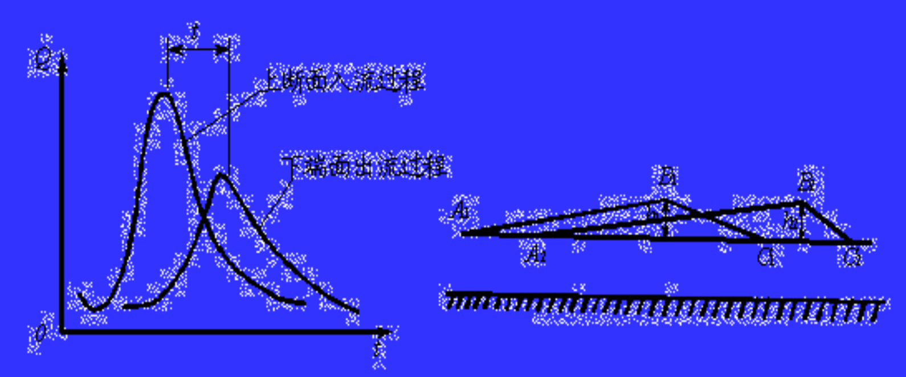
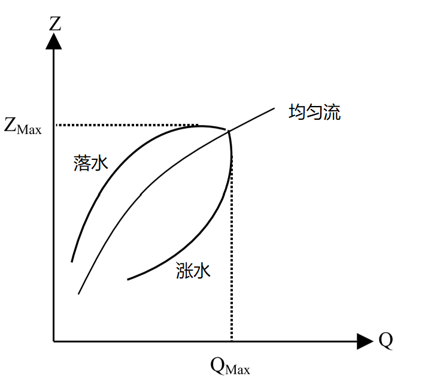

  

---------------------------------------------------------------------------------

# 圣维南方程组

*Saint Venant Equations 2*  

本篇主要是继续介绍水力学中相关概念以及在圣维南模型框架下的明渠水流理论。
 
+ [动力波与运动波、扩散波、惯性波](#动力波与运动波、扩散波、惯性波)
+ [缓坡、临界坡和陡坡](#缓坡、临界坡和陡坡)
+ [弯道水流和水跃](#弯道水流和水跃)
+ [棱柱体明渠水面线分析](#棱柱体明渠水面线分析)
+ [量纲分析](#量纲分析)
+ [相似原理](#相似原理)

---------------------------------------------------------------------------------

## 动力波和运动波、扩散波、惯性波

*Dynamic Wave & Kinematic Wave、Diffusion Wave、Inertial Wave*

明渠洪水波的运动特征：
1. **相位**，洪水波轮廓线上任一点的位置；**波速**，洪水波波体上某一相位点沿程运动速度，$C_k = \frac{\mathrm{d}s}{\mathrm{d}t}$；
2. **相应流量**，洪水波波体上某相位点对应的断面流量；**相应水位**，波体上某相位点对应的断面水位 ；
3. **附加比降**，洪水波的水面比降与恒定流时的水面比降的差值。

一般的，洪水波波前水面比恒定流更陡，故波前附加比降为正；而洪水波波后水面较平缓，故波后附加比降为负。

由于洪水波波前水面比降大于恒定流、波后水面比降小于恒定流，  
所以波前各相位点的波速大于波后，从而导致洪水波波体拉长，波长变大、波峰变小，称为 **洪水波的坦化变形**。  
由于洪水波各相位点的波高不同、水深不同，从而导致波速不同；  
波峰处流速最大。因此在洪水波传播中，波峰不断前移，波前缩短、附加比降增大，波前流量不断向波后转移，  
称为 **洪水波的扭曲变形**。

一般的，当明渠来流大于断面水位在恒定流下过流能力时，则水位上涨、蓄量增加，所经历时间称为涨洪历时。  
洪水波从明渠上游传到下游，由于坦化变形，波峰降低、波长拉长；由于扭曲变形，波前缩短、涨水历时缩短。  
洪水波的坦化和扭曲变形是洪水波传播中由内因造成的，但区间内水量的变化、断面的变化等外因会影响结果。
 
洪水波根据主导影响因素，可以分为：动力波、惯性波、扩散波、运动波。
$$
\textbf{动力波}，i - \frac{\partial h}{\partial s} = \frac{\partial h_f}{\partial s} + \frac{1}{g} \frac{\partial v}{\partial t} + \frac{v}{g}\frac{\partial v}{\partial s}  \\
\textbf{运动波方程}，i = \frac{\partial h_f}{\partial s}；\textbf{扩散波方程}，i - \frac{\partial h}{\partial s} = \frac{\partial h_f}{\partial s}；\textbf{惯性波方程}，i - \frac{\partial h}{\partial s} = \frac{1}{g} \frac{\partial v}{\partial t} + \frac{v}{g}\frac{\partial v}{\partial s}
$$

*------------------ * ------------------*

**运动波** 只考虑摩阻和底坡的主导作用，忽略运动方程中的惯性项和压力项。  
采用恒定均匀流计算摩阻坡度  
$$i = \frac{\partial h_f}{\partial s} = J_f = \frac{Q^2}{K^2} = \frac{v^2}{C^2 R} \quad \Rightarrow Q = K \sqrt{i}$$

因流量模数 K 是断面形状和水深的函数；故对于固定断面而言，流量与水位呈单值关系 Q = f(Z) 或 Q = f(A)；  
由于水位流量呈单一关系，断面最大流量、断面最高水位、沿程最大流量和沿程最大水深重合在同一个断面；
$$\frac{\partial A}{\partial t} = \frac{\partial A}{\partial Q} \frac{\partial Q}{\partial t} \quad \Rightarrow \frac{\partial Q}{\partial A} = C_k = v + A \frac{\partial v}{\partial A} = v \eta, \quad \textbf{波速系数} \eta = (1 + \frac{A}{v} \frac{\partial v}{\partial A})$$

代入不可压缩非恒定流连续性方程，可以得到 **对流方程**：  
$$\frac{\partial Q}{\partial t} + C_k \frac{\partial Q}{\partial s} = 0$$

特征线方程及方程解：  
$$\textbf{特征线}，\frac{\mathrm{d} s}{\mathrm{d} t} = C_k; \quad \textbf{特征关系}，\frac{\mathrm{d} Q}{\mathrm{d} t} = 0$$

由特征线方程可知，运动波只有顺特征线、没有逆特征线（下游无法影响上游），运动波只能向下游传播 。  
由特征关系可知，运动波沿特征线传播时，任何点的相应流量都不发生变化，即运动波不会发生坦化变形 。  
山区河流由于底坡较大，其洪水波接近运动波；同时因摩阻坡度非负，所以运动波方程只适用于**顺坡流动** 。

根据波速 Ck 的性质，可以判断运动波是否发生扭曲变形：  
1. 若波速 $C_k$ 为常数，则运动波上每一相应流量和相应水位都以相同速度向下游传播，波没有扭曲变形；
2. 若波速 $C_k$ 为流量或水深的函数，运动波将扭曲变形但**波峰不变、无耗散**；至波前垂直，为**运动激波**；
3. 一般情况下，流速随水深而增加，故运动波一般具有扭曲变形；故波速系数一般大于 0，波速要大于断面流速。

*------------------ * ------------------*

**扩散波** 忽略了惯性项，但是保留压力项（由此水面线与底坡不再平行）。  
采用恒定均匀流计算摩阻坡度  
$$\begin{gathered}
i - \frac{\partial h}{\partial s} = \frac{\partial h_f}{\partial s} \quad \Rightarrow Q = K \sqrt{i} \cdot \sqrt{1 - \frac{1}{i} \frac{\partial h}{\partial s}} = Q_0 \sqrt{1 - \frac{1}{i} \frac{\partial h}{\partial s}}  \\
Q_0, \quad 恒定均匀流下流量
\end{gathered}$$

方程表明，对于某一固定断面，涨洪时 $\frac{\partial h}{\partial s} < 0$，所以流量 Q > Q0；落洪时 $\frac{\partial h}{\partial s} > 0$，故流量 Q < Q0。  
所以，扩散波运动中断面水位与流量呈现**逆时针**的绳套曲线关系。在一场洪水波过程中，  
断面流量首先达到最大值，之后水位达到最大值。

对于宽浅矩形棱柱形明渠，宽度为 B，近似存在 $ R \approx h, A = B h$；若不考虑旁侧入流：  
$$\begin{cases}
\frac{\partial h}{\partial s} = i -  \frac{Q^2}{A^2 C^2 R}  \qquad \Rightarrow \frac{\partial^2 h}{\partial s \partial t} = \frac{2Q}{C^2 B^2 h^3} \frac{\partial Q}{\partial t} + \frac{3 Q^2}{C^2 B^2 h^4} \frac{\partial h}{\partial t}  \\
  \\
B \frac{\partial h}{\partial t} + \frac{\partial Q}{\partial t} = 0 \qquad \Rightarrow \frac{\partial h}{\partial t} = -\frac{1}{B} \frac{\partial Q}{\partial s} \quad \Rightarrow \frac{\partial^2 h}{\partial t \partial s} = -\frac{1}{B} \frac{\partial^2 Q}{\partial s^2}
\end{cases}$$

综合，得到：  
$$\frac{\partial Q}{\partial t} + (\frac{3}{2} \frac{Q}{B h})\frac{\partial Q}{\partial s} = (\frac{C^2 B^2 h^3}{2 Q}) \frac{\partial^2 Q}{\partial s^2}$$

令：  
$$\textbf{波速} \quad C_k = \frac{3}{2} \frac{Q}{B h} = 1.5 v \approx 1.5 v_0; \quad \textbf{扩散系数} \quad D = \frac{C^2 B^2 h^3}{2 Q} = \frac{Q}{2 B J_f} \approx \frac{Q_0}{2 B i}$$

得到 **对流扩散方程**：  
$$\frac{\partial Q}{\partial t} + C_k \frac{\partial Q}{\partial s} = D \frac{\partial^2 Q}{\partial s^2}$$

特征线及特征关系：  
$$\textbf{特征线}，\frac{\mathrm{d} s}{\mathrm{d} t} = C_k; \quad \textbf{特征关系}，\frac{\mathrm{d} Q}{\mathrm{d} t} = D \frac{\partial^2 Q}{\partial s^2}$$

由特征线方程可知，扩散波只有顺特征线（ 下游无法影响上游），同时扩散波只能以波速 Ck 向下游传播。  
由特征关系可知，扩散波沿特征线传播时相应流量会发生变化，即扩散波会发生波峰变形；**运动波是特例**。

*------------------ * ------------------*

**惯性波** 只考虑惯性力的主导作用，保留压力项、忽略运动方程中摩阻项。  
$$\frac{\partial h}{\partial s} + \frac{1}{g} \frac{\partial v}{\partial t} + \frac{v}{g}\frac{\partial v}{\partial s} = i$$

明渠中波的相对传播速度：$v_w = \sqrt{gh}$；联立连续性方程，将各项乘以g；方程组分别相加、相减，得到：    
$$\begin{cases}
\frac{\partial }{\partial t} (v + 2 v_w) + (v + v_w) \frac{\partial }{\partial s}(v + 2 v_w) = gi  \\
  \\
\frac{\partial }{\partial t} (v - 2 v_w) + (v - v_w) \frac{\partial }{\partial s}(v - 2 v_w) = gi
\end{cases}$$

令：  
$$\psi = v \pm 2v_w; \qquad f = v \pm v_w; \qquad \eta = gi$$

由此，原方程组合成得到：  
$$\frac{\partial \psi}{\partial t} + f \frac{\partial \psi}{\partial s} = \eta$$

由此可得到该拟线性方程的**特征方程组**，包括 两个**特征方向方程** $\frac{\mathrm{d} s}{\mathrm{d} t} = f$，两个**特征微分关系** $\frac{\mathrm{d} \psi}{\mathrm{d} t} = \eta$。

将特征方程展开，可得到：  
$$\begin{cases}
\textbf{顺特征方向}：\frac{\mathrm{d} s}{\mathrm{d} t} = v + \sqrt{gh}, \quad \frac{\mathrm{d} (v + 2 \sqrt{gh})}{\mathrm{d} t} = g i  \\
  \\
\textbf{逆特征方向}：\frac{\mathrm{d} s}{\mathrm{d} t} = v - \sqrt{gh}, \quad \frac{\mathrm{d} (v - 2 \sqrt{gh})}{\mathrm{d} t} = g i  \\
\end{cases}$$

方程表明，矩形明渠水流有两簇不同的实特征线；顺、逆特征方向存在非恒定流顺波和逆波的绝对速度。  
明渠水流中，弗劳德数 $F_r = \frac{v}{\sqrt{gh}} = \frac{v}{v_w}$ 。  
当 Fr < 1 时，水流为缓流，微波不会向上游传播、只影响下游；$v < \sqrt{gh}$，逆特征方向$\frac{\mathrm{d} s}{\mathrm{d} t} < 0$，印证。  
当 Fr > 1 时，水流为急流，微波可以向上游传播、能影响下游；$v > \sqrt{gh}$，逆特征方向$\frac{\mathrm{d} s}{\mathrm{d} t} > 0$，印证。

惯性波没有摩阻项，故无能量损失；惯性波传播中，只有能量转换（流速和水深），为周期性的振荡波。  
惯性波中惯性力起主导作用，摩阻和底坡影响小（亦可忽略）；入库洪水波、闸门启闭的波动近似如此。

[<i class="fa fa-home"></i>](#圣维南方程组)

*--- 本章作者：---*

[1] **朗月**，“ 希望这篇文章能够为你提供帮助，如有错误望不吝指正，欢迎交流！:D ” 

*--- 参考资料：---*

[1] 吴持恭. 水力学：上、下册[M]. 高等教育出版社, 2007.    
[2] 王船海,李光炽. 实用河网水流计算[M]. 河海大学水资源水文系, 2003-9.  

---------------------------------------------------------------------------------

## 缓坡、临界坡和陡坡

*Gentle Slope、Critical Slope & Steep Slope*

 

[<i class="fa fa-home"></i>](#圣维南方程组)

---------------------------------------------------------------------------------

## 弯道水流和水跃

*Bend Flow & Hydraulic Jump*

 

[<i class="fa fa-home"></i>](#圣维南方程组)

---------------------------------------------------------------------------------

## 棱柱体明渠水面线分析

*Analysis for Water Surface Line of Prismatic Open Channel*

 

[<i class="fa fa-home"></i>](#圣维南方程组)

---------------------------------------------------------------------------------

## 量纲分析

*Dimensional Analysis*

**基本量纲**，具有独立性的量纲，相互之间不能由别的基本量纲组合或推导而得来，比如长度 L、时间 T、质量 M。  
**导出量纲**，不具独立性，可以由上述基本量纲组合或推导得到的量纲。  
当表征一个物理过程的方程已知时，有关此过程的物理量之间的关系即已确定，同时相应的量纲之间关系也确定。 

**量纲分析**，利用量纲之间的规律性去推求各物理量之间规律性的方法。  
物理方程中的各项物理量的量纲之间的规律性：  

1. 物理方程中各项的量纲应当相同，即 **量纲和谐性（齐次性）**；
2. 任何一有量纲的物理方程均可以写为由量纲一的项组成的方程，同时不会改变物理过程的规律性。

任何一物理过程，假设包含有 k+1 个有量纲的物理量，如果选择其中 m 个作为基本物理量，  
那么该物理过程可以由 [(k+1) - m] 个量纲一的数组成的关系式来描述。因为以上这些量纲一的数是用 $\pi$来表示的，  
故称为 **$\pi$ 定理**，又称为 **布金汉定理**。

设已知某物理过程含有 k+1 个物理量（其中 1 个因变量，k 个自变量）；写成一般表达式为：

$$N = f(N_1, N_2, N_3, ..., N_k) \quad or \quad N = \sum_i \alpha_i (N_{1}^{a_i} N_{2}^{b_i} N_{3}^{c_i} ... N_{k}^{n_i})$$

$\alpha$ 为量纲一的系数，$i$ 为项数，a, b, c, d, e, ..., n 为指数。假设选用 N1, N2, N3 三个物理量的量纲作为基本量纲，  
各物理量的量纲均可以统一表示为：  

$$\begin{cases}
N = \pi N_{1}^{x} * N_{2}^{y} * N_{3}^{z}  \\
N_1 = \pi_1 N_{1}^{x_1} * N_{2}^{y_1} * N_{3}^{z_1} \\
N_2 = \pi_2 N_{1}^{x_2} * N_{2}^{y_2} * N_{3}^{z_2} \\
N_3 = \pi_3 N_{1}^{x_3} * N_{2}^{y_3} * N_{3}^{z_3} \\
... \\
N_k = \pi_k N_{1}^{x_k} * N_{2}^{y_k} * N_{3}^{z_k} \\
\end{cases}$$

$\pi, \pi_1, \pi_2, \pi_3, ..., \pi_k$ 为量纲一的比例系数。由量纲和谐性可知各项的量纲（即等式两边的量纲）应相等，因此：  

$$N_1 = 1 * N_{1}, \qquad N_2 = 1 * N_{2}, \qquad N_3 = 1 * N_{3}$$

代入一般表达式，可得：  

$$\begin{aligned}
\pi N_{1}^{x} N_{2}^{y} N_{3}^{z} = \sum_i &\alpha_i (1*1*1*\pi_{4}^{d_i}*\pi_{5}^{e_i}*...*\pi_{k}^{n_i} \\
&* N_{1}{a_i + x_{4}{d_i} + x_{5}{e_i} + ... + x_{k}{n_i}} \\
&* N_{2}{b_i + y_{4}{d_i} + y_{5}{e_i} + ... + y_{k}{n_i}} \\
&* N_{3}{c_i + z_{4}{d_i} + z_{5}{e_i} + ... + z_{k}{n_i}} \space )
\end{aligned}$$

依据量纲和谐性，从而：

$$\begin{cases}
x = a_i + x_{4}{d_i} + x_{5}{e_i} + ... + x_{k}{n_i} \\
y = b_i + y_{4}{d_i} + y_{5}{e_i} + ... + y_{k}{n_i} \\
z = c_i + z_{4}{d_i} + z_{5}{e_i} + ... + z_{k}{n_i} \\
\pi = \sum_i \alpha_i (1*1*1*\pi_{4}^{d_i}*\pi_{5}^{e_i}*...*\pi_{k}^{n_i}),  \quad \pi_k = \frac{N_k}{N_{1}^{x_k}  N_{2}^{y_k} N_{3}^{z_k}}\\
\end{cases}$$

[<i class="fa fa-home"></i>](#圣维南方程组)

*--- 本章作者：---*

[1] **朗月**，“ 希望这篇文章能够为你提供帮助，如有错误望不吝指正，欢迎交流！:D ” 

*--- 参考资料：---*

[1] 吴持恭. 水力学：下册[M]. 高等教育出版社, 2007. 

---------------------------------------------------------------------------------

## 相似原理

*Similarity Laws*

表征流体运动的量具有各种不同性质，主要有:  
1. 表征流场几何形状的，几何相似；
2. 表征流体运动状态的，运动相似；
3. 表征流体动力状态的，动力相似。

两个流动系统的相似，通过几何相似、运动相似和动力相似来描述。原型中的量注以脚标 P，模型中注以 M 。

**几何相似**，即原型和模型的任何一个相应线性长度保持一定的比例关系，从而保持几何形状和尺寸间的相似 。  
$$\lambda_L = \frac{L_P}{L_M} \quad \Rightarrow  \quad \lambda_A = \lambda_{L}^{2}, \quad \lambda_V = \lambda_{L}^{3}$$

**运动相似**，即原型和模型任何对应质点的迹线几何相似，任何对应质点流过相应线段所需时间具有同一比例 ；  
即，若两个流动的流速场（或加速度场）是几何相似的，则这两个流动是运动相似的 。   
$$\lambda_t = \frac{t_P}{t_M} \quad \Rightarrow  \quad \lambda_v = \frac{\lambda_L}{\lambda_t},  \quad \lambda_a = \frac{\lambda_L}{\lambda_{t}^{2}}$$

**动力相似**，即原型和模型流动中任何对应点上作用着同名的力，各同名的力之间相互平行并且具有同一比值 。  
若以 $G, F_T, F_S, F_E, F_I$ 分别代表重力、粘滞力、表面张力、弹性力和惯性力，则有：  
$$\lambda_G = \lambda_T = \lambda_S = \lambda_E = \lambda_I$$

*------------------ * ------------------*

现以流体力学中描述不可压缩粘性流体运动的纳维-斯托克斯方程为例，推导相似准则 ；  
在 x 方向，原型流动中任意点的运动必须遵循：  
$$f_{xP} - \frac{1}{\rho_P} \frac{\partial p_P}{\partial x_P} + \nu_P \nabla^2 u_{xP} = \frac{\partial u_{xP}}{\partial t_P} + u_{xP} \frac{\partial u_{xP}}{\partial x_P} + u_{yP} \frac{\partial u_{xP}}{\partial y_P} + u_{zP}\frac{\partial u_{xP}}{\partial z_P}$$  

模型流动中任意点的运动必须遵循：  
$$f_{xM} - \frac{1}{\rho_M} \frac{\partial p_M}{\partial x_M} + \nu_M \nabla^2 u_{xM} = \frac{\partial u_{xM}}{\partial t_M} + u_{xM} \frac{\partial u_{xM}}{\partial x_M} + u_{yM} \frac{\partial u_{xM}}{\partial y_M} + u_{zM}\frac{\partial u_{xM}}{\partial z_M}$$ 

两相似流动之间存在此些比尺关系：  
$$f_{xP} = \lambda_g f_{xM}, \quad \rho_P = \lambda_{\rho} \rho_M, \quad \nu_P = \lambda_{\nu} \nu_M, \quad p_P = \lambda_p p_M, \quad t_p = \lambda_t t_M,  \\
u_{xP} = \lambda_v u_{xM}, \quad u_{yP} = \lambda_v u_{yM}, \quad u_{zP} = \lambda_v u_{zM}, \quad L_p = \lambda_L L_M, \\
\lambda_x = \lambda_y = \lambda_z = \lambda_L$$

将以上关系代入原型流动方程，得：  
$$\begin{aligned}
\lambda_g f_{xM} - \frac{\lambda_p}{\lambda_{\rho} \lambda_L} \frac{1}{\rho_M} \frac{\partial p_M}{\partial x_M} + \frac{\lambda_{\nu} \lambda_v}{\lambda_{L}^{2}} \nu_M \nabla^2 u_{xM} \\
\\
= \frac{\lambda_v}{\lambda_t} \frac{\partial u_{xM}}{\partial t_M} + \frac{\lambda_{v}^{2}}{\lambda_L} (u_{xM} \frac{\partial u_{xM}}{\partial x_M} + u_{yM} \frac{\partial u_{xM}}{\partial y_M} + u_{zM}\frac{\partial u_{xM}}{\partial z_M})
\end{aligned}$$

如果两个流动相似，从而可以得到：  
$$\lambda_g = \frac{\lambda_p}{\lambda_{\rho} \lambda_L} = \frac{\lambda_{\nu} \lambda_v}{\lambda_{L}^{2}} = \frac{\lambda_v}{\lambda_t} = \frac{\lambda_{v}^{2}}{\lambda_L} $$

1. $\lambda_g$ 为原型和模型流体的重力之间的比值；
2. $\frac{\lambda_p}{\lambda_{\rho} \lambda_L}$ 为动水压强间的比值；
3. $\frac{\lambda_{\nu} \lambda_v}{\lambda_{L}^{2}} $ 为粘滞力之间的比值；
4. $\frac{\lambda_v}{\lambda_t}$ 为当地加速度产生的当地惯性力比值；
5. $\frac{\lambda_{v}^{2}}{\lambda_L}$ 为位移加速度产生的位移惯性力比值。

将各项除以位移惯性力的比值可得：  
$$\begin{cases}
\frac{\lambda_{v}^{2}}{\lambda_g \lambda_L} = 1 \quad \Rightarrow \frac{v_{P}^{2}}{g_P L_P} = \frac{v_{M}^{2}}{g_M L_M} \\
\frac{\lambda_p}{\lambda_{\rho} \lambda_{v}^{2}} = 1 \quad \Rightarrow \frac{p_P}{\rho_P v_{P}^{2}} = \frac{p_M}{\rho_M v_{M}^{2}} \\
\frac{\lambda_v \lambda_L}{\lambda_{\nu}} = 1 \quad \Rightarrow \frac{v_P L_P}{\nu_P} = \frac{v_M L_M}{\nu_M} \\
\frac{\lambda_L}{\lambda_v \lambda_t} = 1 \quad 
\Rightarrow \frac{L_P}{v_P t_P} = \frac{L_M}{v_M t_M}
\end{cases}$$

1. 数量纲一的数 $\frac{v^2}{gL}$，为重力和位移惯性力的比值，称 **弗劳德数Fr** ；
2. 数量纲一的数 $\frac{p}{\rho v^2}$，表征动水压强和位移惯性力之间的比值，称为 **欧拉数Eu**；
3. 数量纲一的数 $\frac{v L}{\nu}$，为粘滞力与位移惯性力的比值，称 **雷诺数Re**；
4. 数量纲一的数 $\frac{L}{v t}$，为当地惯性力与位移惯性力之间的比值，**斯特劳哈尔数St** 。

*------------------ * ------------------*

**牛顿相似准则**，牛顿数 $Ne = \frac{F}{\rho L^2 v^2}$ 表征作用力与惯性力的比值（量纲一），两个相似流动的牛顿数应相等。

**重力相似准则**，作用力只有重力（或主导力）时，两个相似的流动系统的弗劳德数应相等，又称 弗劳德准则。 

**阻力相似准则**，除了要保证两个流动系统的弗劳德数相等（重力相似），还要保证二者的水力坡度同样相等 。  
当水流处于阻力平方区，若模型与原型的相对粗糙度相等，即满足阻力相似 ；  
当水流为层流，要求模型与原型弗劳德数和雷诺数均相等，可满足阻力相似 。

**雷诺相似准则**，当模型与原型两个流动系统的雷诺数相等时，此时二者满足粘滞力作用相似。

**惯性力相似准则**，若当地惯性力在流动中起主要作用，则模型与原型两个流动系统的斯特劳哈尔数必须相等。

**弹性力相似准则**，若弹性力在流动中起重要作用（如水击），若模型与原型的柯西数必须相等则弹性力相似。  
弹性力 $F_E = K L^2$，K 为流体体积模量；从而，  
$\lambda_F = \lambda_E = \lambda_K \lambda_{L}^{2}$，从而有 $\frac{\lambda_{\rho} \lambda_{v}^{2}}{\lambda_K} = 1 \quad \Rightarrow \frac{\rho v^2}{K} = C_a$，即 **柯西数**。

**表面张力相似准则**，若表面张力起着主导作用（如毛细管），若模型与原型的韦伯数相等则有表面张力相似。  
表面张力 $F_S = \sigma L$，σ 为单位长度的表面张力；  
$\lambda_F = \lambda_{S \sigma} = \lambda_{\sigma} \lambda_{L}$，从而 $\frac{\lambda_{\rho} \lambda_L \lambda_{v}^{2}}{\lambda_{\sigma}} = 1 \quad \Rightarrow \frac{\rho L v^2}{\sigma} = W_e$，**韦伯数** 。

**压力相似准则**，要使模型和原型两个流动系统满足压力相似，则要求二者的欧拉数必须相等，又称欧拉准则。  
欧拉数中的动水压强 p 可用压差 Δp 代替，此时  
$$E_u = \frac{\Delta p}{\rho v^2}$$

研究 **空化现象**，通常 Δp 采用某处的绝对压强与汽化压强的差表示，此时将 2 倍欧拉数作为衡量空化的指标：  
$$K = 2 E_u = \frac{\Delta p}{0.5 \rho v^2}, \quad K \textbf{为空化指数}$$

*------------------ * ------------------*

一般情况下，水流的表面张力、弹性力可以忽略，恒定流时没有当地惯性力，故作用在流体上的主要作用力：  
重力、摩檫力和动水压力。  

要使两个流体相似，则弗劳德数、雷诺数和欧拉数要相等。事实上，三个准则中两个满足，另一个自动满足。  
这种情况下，弗劳德准则、雷诺准则称为 独立准则，欧拉准则称为 诱导准则。

[<i class="fa fa-home"></i>](#圣维南方程组)

*--- 本章作者：---*

[1] **朗月**，“ 希望这篇文章能够为你提供帮助，如有错误望不吝指正，欢迎交流！:D ” 

*--- 参考资料：---*

[1] 吴持恭. 水力学：下册[M]. 高等教育出版社, 2007. 

---------------------------------------------------------------------------------