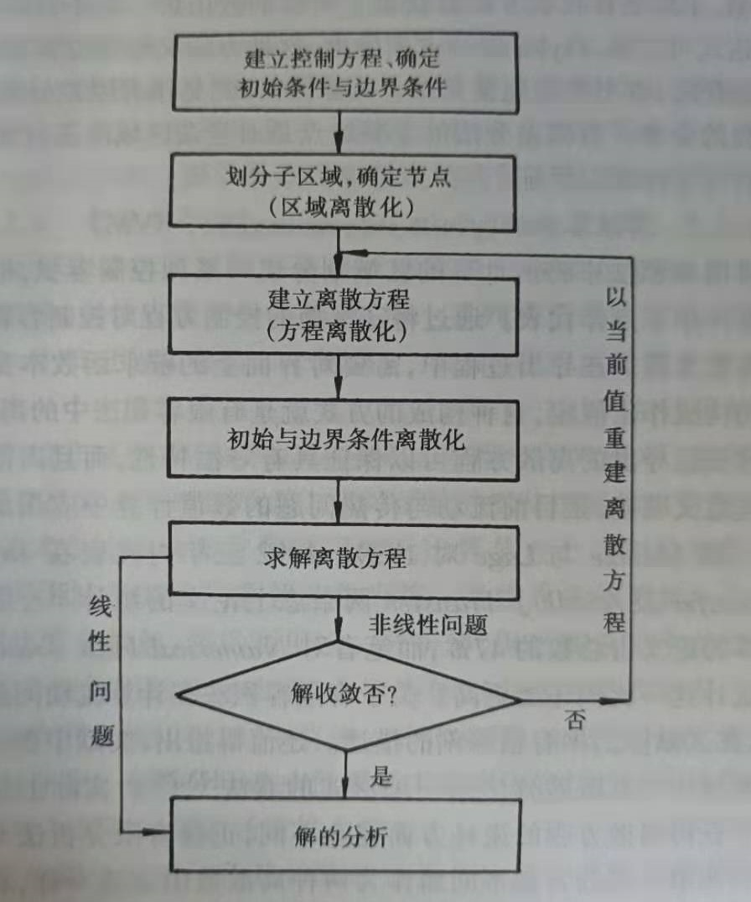
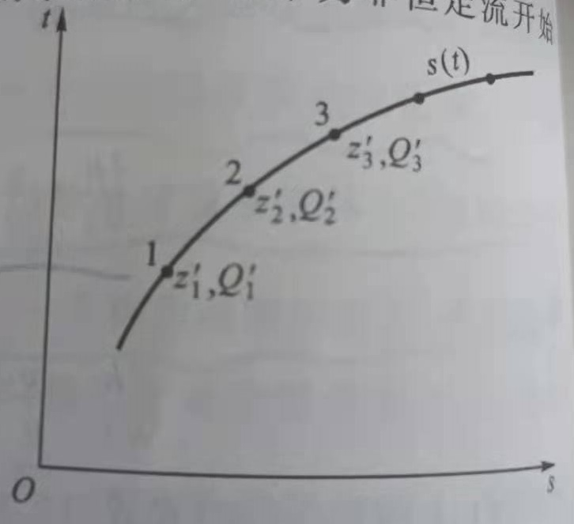
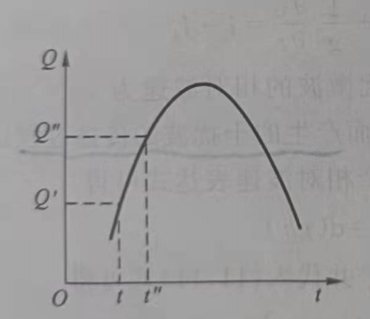
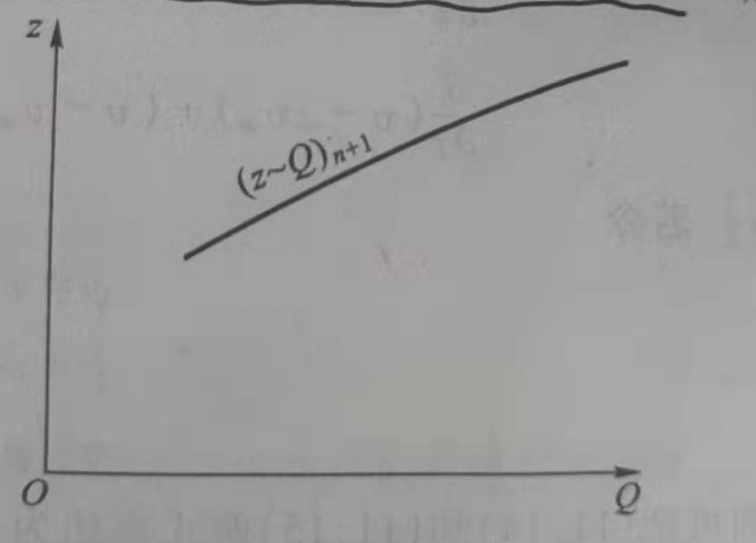
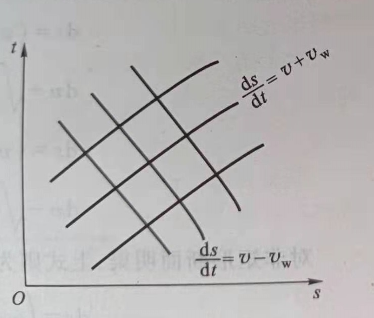
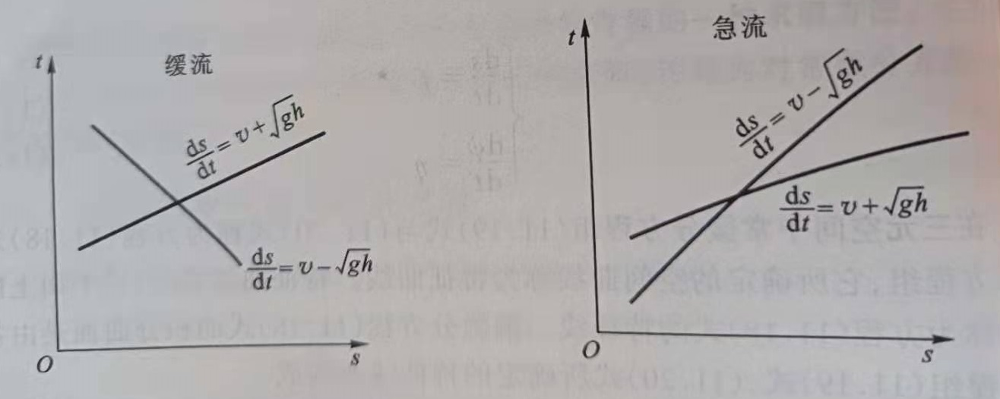
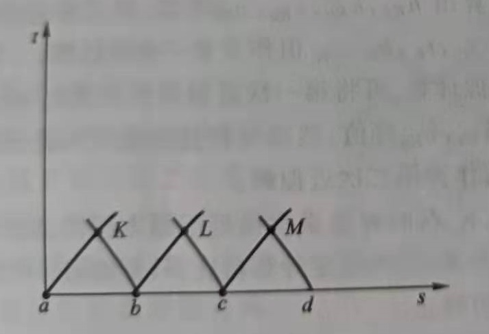
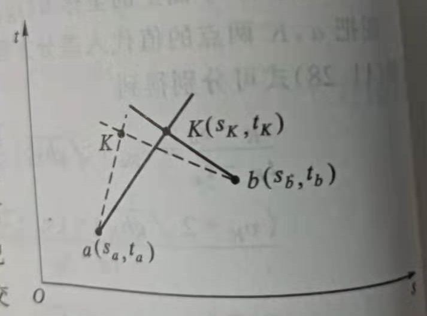
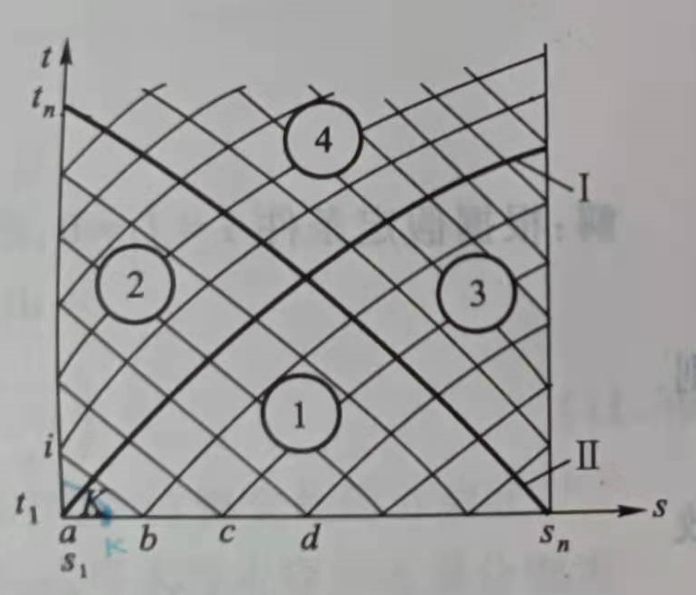

  

---------------------------------------------------------------------------------

# 数值算法

*Numerical Computing Methods*  

**计算流体力学** ( CFD, Computational Fluid Dynamics ) 的一般性思路：将原来在空间与时间坐标系中连续的物理量的场，  
（如温度场、速度场、压力场等），用一系列有限个离散点（节点）上的值的集合来代替，  
通过一定的原则建立起这些离散点上变量值之间关系的代数方程（离散方程），求解方程组获得所求解变量的近似值。

**初始条件**，通常是指非恒定流的起始时刻的水流条件，通常为非恒定流开始前的恒定流的流量与水位状态；一般而言，  
初始条件可以是开始计算的任何指定时刻的水流条件。

**第一边界条件**（上游边界条件），产生非恒定流的首断面应满足的水力条件，通常为首断面流量过程线或水位过程线。  
**第二边界条件**（下游边界条件），非恒定流可能波及的末端断面应满足的水力条件，通常为水位流量关系或稳定水位。

---------------------------------------------------------------------------------

## Characteristic Line Method

*特征线法*

采用特征线方法求解一阶偏微分方程，主体思路是采用中间变量将其转为常微分方程组，从而得到沿特征线的方程解。  
$$a(x, y, u) \frac{\partial u}{\partial x} + b(x, y, u) \frac{\partial u}{\partial y} = c(x, y, u)$$

假设 $u = u(x, y)$ 是定义在 $\mathbb{R}^2$ 上的光滑函数；假设自变量 x, y 是变量 t 的函数；  
令 $\gamma = \gamma (x(t), y(t))$ 是$\mathbb{R}^2$ 平面上函数 u 的**特征线**，$u| \gamma = u(x(t), y(t))$是函数 u 在特征线 $\gamma$上的值（方程解）。  
$$\frac{\mathrm{d} u}{\mathrm{d} t} | \gamma = u_x \frac{\mathrm{d} x}{\mathrm{d} t} | \gamma + u_y \frac{\mathrm{d} y}{\mathrm{d} t} | \gamma$$  

从而，在特征线上有：  
$$\frac{\mathrm{d} x}{\mathrm{d} t} | \gamma = a(x, y, u), \quad \frac{\mathrm{d} y}{\mathrm{d} t} | \gamma = b(x, y, u) \qquad and \quad \frac{\mathrm{d} u}{\mathrm{d} t} | \gamma = c(x, y, u)$$

从而，实现将偏微分方程转为一组常微分方程；其中，得到特征线簇方程的同时，可以得到原方程在特征线上的解。

一维对流方程（一维欧拉方程）初值问题为例：
$$\begin{cases}
\frac{\partial u}{\partial t} + c \frac{\partial u}{\partial x} = 0  \\
  \\
u(x, 0) = \psi (x)
\end{cases}$$

引入中间变量 s，构造对流方程的特征线：$\frac{\mathrm{d} t}{\mathrm{d} s} = 1,\frac{\mathrm{d} x}{\mathrm{d} s} = c, \quad and \quad \frac{\mathrm{d} u}{\mathrm{d} s} = 0$。  
$$\frac{\mathrm{d} t}{\mathrm{d} s} = 1  \Rightarrow t = s + c_t ;\quad
\frac{\mathrm{d} x}{\mathrm{d} s} = c \Rightarrow x = cs + c_s ;\quad
\frac{\mathrm{d} u}{\mathrm{d} s} = 0  \Rightarrow u = c_u   \\
\Rightarrow x - ct = c', \quad and \quad u = c_u  \\
\Rightarrow u | \gamma = c_{u}' (x - ct)
$$

由此可知，沿着特征线对流方程的解为常数；不同的特征线上方程的常数解不同。同时，结合初值条件可以得到：  
$$u | {\gamma, 0} = c_{u}' x = \psi (x)$$  

在 x-t 平面（t > 0）上，假设通过点 P 的特征线与 x 轴相交于点 Q。根据对流方程特征线的性质，从而可以得到：   
$$u_P = u_Q \quad \Rightarrow u(x, t) = u(x_0, 0) = \psi (x_0)$$

对于对流方程，利用特征线就可以实现把任意 x 处方程的解转化为 t=0 时方程的初值解。   

可以这样认为，特征线已经是偏微分方程的解，但只是完整解集上的一条线，而完整解集应该是一个高维的曲面。  
显然，线动成面，如果让各个积分常数 “动起来”，就可以得到这个完整解集曲面的方程。  
同时，积分常数不能毫无约束地选取，否则解集可能就会覆盖了整个空间，积分常数的选取受到初值条件的限制。   
因此，根据初值条件来确定积分常数间的约束关系，进而得到完整解集曲面的参数方程。

*------------------ * ------------------*

若将偏微分方程组转化为常微分方程组从而求解，对于矩形明渠圣维南方程组（一阶拟线性双曲型偏微分方程）：  
$$\begin{cases}
\frac{\partial h}{\partial t} + h \frac{\partial v}{\partial s} + h\frac{\partial h}{\partial s} = 0  \\
  \\
\frac{\partial h}{\partial s} + \frac{v}{g} \frac{\partial v}{\partial s} + \frac{1}{g} \frac{\partial v}{\partial t} = i - J_f
\end{cases}$$

明渠中波的相对传播速度：$v_w = \sqrt{gh}$；方程各项乘以g，得：  
$$ \Rightarrow \quad 
\begin{cases}
2 \frac{\partial v_w}{\partial t} + v_w \frac{\partial v}{\partial s} + 2 v \frac{\partial v_w}{\partial s} = 0  \\
  \\
2 v_w \frac{\partial v_w}{\partial s} + v \frac{\partial v}{\partial s} + \frac{\partial v}{\partial t} = g (i - J_f)
\end{cases}
$$

方程组分别相加、相减，得到：  
$$  
\begin{cases}
\frac{\partial }{\partial t} (v + 2 v_w) + (v + v_w) \frac{\partial }{\partial s}(v + 2 v_w) = g (i - J_f)  \\
  \\
\frac{\partial }{\partial t} (v - 2 v_w) + (v - v_w) \frac{\partial }{\partial s}(v - 2 v_w) = g (i - J_f)
\end{cases}$$

令：  
$$\psi = v \pm 2v_w; \qquad f = v \pm v_w; \qquad \eta = g (i - J_f)$$

则 ，原方程组可以合成得到：  
$$\frac{\partial \psi}{\partial t} + f \frac{\partial \psi}{\partial s} = \eta$$

由此，从而可以得到该拟线性方程的**特征方程组**，包括 两个**特征方向方程** $\frac{\mathrm{d} s}{\mathrm{d} t} = f$，两个**特征微分关系** $\frac{\mathrm{d} \psi}{\mathrm{d} t} = \eta$。  
方程的解 $\psi (s, t)$ 在三元空间 $(\psi, s, t)$ 内表示一曲面，称**积分曲面**；特征方程组所确定的空间曲线称为特征曲线。

将特征方程展开，得到：  
$$\begin{cases}
\textbf{顺特征方向}：\frac{\mathrm{d} s}{\mathrm{d} t} = v + \sqrt{gh}, \quad \frac{\mathrm{d} (v + 2 \sqrt{gh})}{\mathrm{d} t} = g (i - \frac{v^2}{C^2 R})  \\
  \\
\textbf{逆特征方向}：\frac{\mathrm{d} s}{\mathrm{d} t} = v - \sqrt{gh}, \quad \frac{\mathrm{d} (v - 2 \sqrt{gh})}{\mathrm{d} t} = g (i - \frac{v^2}{C^2 R})  \\
\end{cases}$$

方程表明，矩形明渠水流中存在两簇不同的实特征线；顺、逆特征方向存在非恒定流顺波和逆波传播的绝对速度。  
明渠水流中，弗劳德数 $F_r = \frac{v}{\sqrt{gh}} = \frac{v}{v_w}$ 。  
当 Fr < 1 时，水流为缓流，水流中微波不会向上游传播、只能影响下游；$v < \sqrt{gh}$，逆特征方向$\frac{\mathrm{d} s}{\mathrm{d} t} < 0$，印证。  
当 Fr > 1 时，水流为急流，水流中微波可以向上游传播、也能影响下游；$v > \sqrt{gh}$，逆特征方向$\frac{\mathrm{d} s}{\mathrm{d} t} > 0$，印证。

首先，要将特征方程组改写为差分方程组：  
$$\begin{cases}
\textbf{顺特征方向}：\frac{\Delta s}{\Delta t} = v + \sqrt{gh}, \quad \frac{\Delta (v + 2 \sqrt{gh})}{\Delta t} = g (i - \frac{n^2 v^2}{R^{4/3}})  \\
  \\
\textbf{逆特征方向}：\frac{\Delta s}{\Delta t} = v - \sqrt{gh}, \quad \frac{\Delta (v - 2 \sqrt{gh})}{\Delta t} = g (i - \frac{n^2 v^2}{R^{4/3}})  \\
\end{cases}$$

**域内点的求解**：s-t 平面上，根据初始条件知初始 a、b、c、d ... 各点的值，求域内邻近的 K、L、M ... 诸点的值。  
设 K 点坐标为 $(s_K, t_K)$，相应的函数值为 $(v_K, h_K)$。  
将a、K 两点的值代入顺特征差分方程及微分关系，将b、K 两点的值代入逆特征差分方程及微分关系；分别得到：  
$$\begin{gathered}
\begin{cases}
\frac{s_K - s_a}{t_K - t_a} = v_{Ka} + \sqrt{g h_{Ka}} \\
  \\
\frac{(v_K + 2 \sqrt{g h_K}) - (v_a + 2 \sqrt{g h_a})}{t_K - t_a} = g (i - \frac{n^2 v_{Ka}^{2}}{R_{Ka}^{4/3}})
\end{cases}
\quad 
\begin{cases}
\frac{s_K - s_b}{t_K - t_b} = v_{Kb} + \sqrt{g h_{Kb}} \\
  \\
\frac{(v_K + 2 \sqrt{g h_K}) - (v_b + 2 \sqrt{g h_b})}{t_K - t_b} = g (i - \frac{n^2 v_{Kb}^{2}}{R_{Kb}^{4/3}})
\end{cases}
\end{gathered}$$

其中，  
$$
\begin{cases}
v_{Ka} = \frac{1}{2} (v_K + v_a)  \\
v_{Kb} = \frac{1}{2} (v_K + v_b)
\end{cases} \qquad 
\begin{cases}
h_{Ka} = \frac{1}{2} (h_K + h_a)  \\
h_{Kb} = \frac{1}{2} (h_K + h_b)
\end{cases} \qquad and
\begin{cases}
R_{Ka} = \frac{1}{2} (R_K + R_a)  \\
R_{Kb} = \frac{1}{2} (R_K + R_b)
\end{cases}
$$

根据初始条件已知 $s_a, s_b, h_a, h_b, v_a, v_b, t_a, t_b$ 诸值，结合以上近似，采用 **逐步逼近法** 来求解 $s_K, t_K, h_K, v_K$。

1. 第一次近似，在 a、b 两点的值附近假定一组 $(h_K, v_K)$，代入计算出 $h_{Ka}, h_{kb}, v_{Ka}, v_{Kb}$ 等值; 
2. 代入差分方程组，计算出一组 $(s_K, t_K, h_K, v_K)$ 值； 
3. 第二次近似计算，将第一次近似得到的 $(h_K, v_K)$ 代入，重新计算出 $h_{Ka}, h_{kb}, v_{Ka}, v_{Kb}$ 等值 ;  
4. 代入差分方程组，重新计算出 $(s_K, t_K, h_K, v_K)$ 值；   
5. 判断相邻两次近似解的差值，若小于一定的允许误差即可认为计算完成；否则，重复以上步骤。

**边界点的求解**：以求解第一边界（s1断面）上的值为例；已知靠近边界断面 s1 的 K 点的值，求边界上 i 点的值。  
第一边界条件 $v_{s=s_1} = v(t) \space or \space h_{s = s_1} = h(t)$。    
对于 i 点，仅知 $s_i = s_1$，$t_i, v_i, h_i$ 未知，所以 i 点在 t 轴上位置未定；对 K，i 两点，应满足逆特征差分方程组：  
$$
\begin{cases}
\frac{s_i - s_K}{t_i - t_K} = v_{iK} + \sqrt{g h_{iK}} \\
  \\
\frac{(v_i + 2 \sqrt{g h_i}) - (v_K + 2 \sqrt{g h_K})}{t_i - t_K} = g (i - \frac{n^2 v_{iK}^{2}}{R_{iK}^{4/3}})
\end{cases}
$$

1. 首先假定一个 $t_i$ 值，代入差分方程计算得出一组 ($v_i, h_i)$；同时，以 $t_i$ 在第一边界中插值得出一组 $(v_i, h_i)$；  
2. 如果两组值相等，则计算完成；否则，重新假定 $t_i$、重复以上步骤。

**综上所述，由初始条件出发、加上边界条件，可以逐步将域内或界上若干点的值解出。**  

通过连接域内、边界上的这些点，即可以得到特征线网。如果时间和距离间隔取得愈小，则网格愈密、精度愈高。  
特征线网中存在两条特殊的特征线，线 **Ⅰ** 是由第一边界 s1 断面上干扰开始时刻出发的顺特征线；线 **Ⅱ** 是  
由第二边界 sn 断面上初始时刻出发的逆特征线。  
线 **Ⅰ** 的轨迹反映了非恒定流波的传播所到达的位置和相应时间；线 **Ⅱ** 表示受到下游边界水流条件控制的轨迹线。  

根据顺、逆特征线的性质，结合域内点的求解过程，分析特征线网可知：   
1. 从上游 s1 出发的顺特征线表示上游干扰的传播轨迹（影响范围）；从 s1 出发的顺特征线都位于线 **Ⅰ** 上方； 
2. 从下游 sn 出发的逆特征线表示下游干扰的传播轨迹（影响范围）；从 sn 出发的逆特征线都位于线 **Ⅱ** 上方； 
3. 特征线网，区域**④** 同时受上、下游边界影响，区域**②、③** 分别受上、下游边界影响，区域**①** 只受初值影响。

*------------------ * ------------------*

黎曼不变量的性质只适用于稀疏波和接触间断，不适用于激波。   
黎曼不变量是对欧拉方程源变量前的矩阵对角化解耦得到的；激波在特征分析中是特征线汇聚地方，是一个间断；  
因为对于拟线性和非线性方程组而言，激波并不是沿特征线传播，所以跨过激波前后没有黎曼不变量保持的性质。  
这种情况下，只能通过Rankine-Hugoniot条件来确定。要注意的是，虽然跨过激波前后不等熵，但是等焓的过程。

**等熵流动**，流体系统各部分的熵在运动过程中都保持不变的流动，要求每个流体质点的熵在流动过程中保持不变。  
$$\frac{\mathrm{d} S}{\mathrm{d} t} = \frac{\partial S}{\partial t} + \textbf{v} \cdot \nabla S = 0$$

可逆的绝热流动都是等熵流动，不可逆的绝热流动则是不等熵流动；熵表示的能量方程：  
$$\rho T \frac{\mathrm{d} S}{\mathrm{d} t} = \nabla \cdot (k \nabla T) + \Phi $$

其中，$T$ 为热力学温度，$k$ 为热导率，$\Phi$ 为粘性损耗项；$\frac{\mathrm{d} S}{\mathrm{d} t} = 0$，等熵要求热传导项与粘性损耗项恰好相等 。  
从能量方程中可以发现，忽略粘性和热传导的（理想）流体连续运动一定也是等熵流动 。

*------------------ * ------------------*

双曲型偏一阶微分方程沿特征线因变量的一阶导数具有不定值，可以是不连续的；这种情况下，特征线是 **弱间断**。  
因此，如果在物理平面上有激波出现，在 **强间断** 面上便无法建立因变量的全微分式，即无法使用特征线方法求解。

*--- 本章作者：---*

[1] **朗月**. “ 希望这篇文章能够为你提供帮助，如有错误望不吝指正，欢迎交流！:D ” 

*--- 参考资料：---*

[1] [苏剑林. 偏微分方程的特征线法](https://www.spaces.ac.cn/archives/4718)   
[2] [彭文博. 偏微分方程：特征线法](https://zhuanlan.zhihu.com/p/340161952)    
[3] [吴持恭. 水力学：下册[M]. 高等教育出版社, 2007.]()  
[4] [Tours. 线性代数中的特征线以及特征值如何理解？](https://www.zhihu.com/question/29343586/answer/107505662)    
[5] [鹏鹏, 花半楼. 欧拉方程与浅水方程中Riemann不变量含义是什么？](https://www.zhihu.com/question/36357012)  

---------------------------------------------------------------------------------
